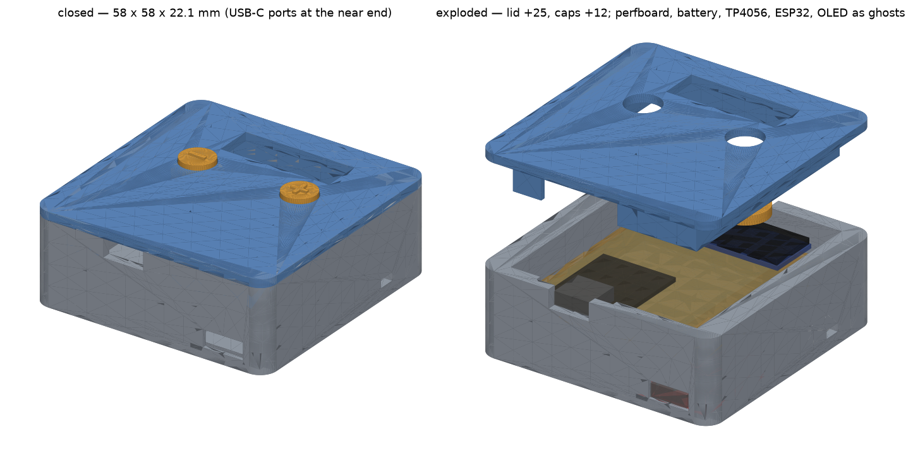
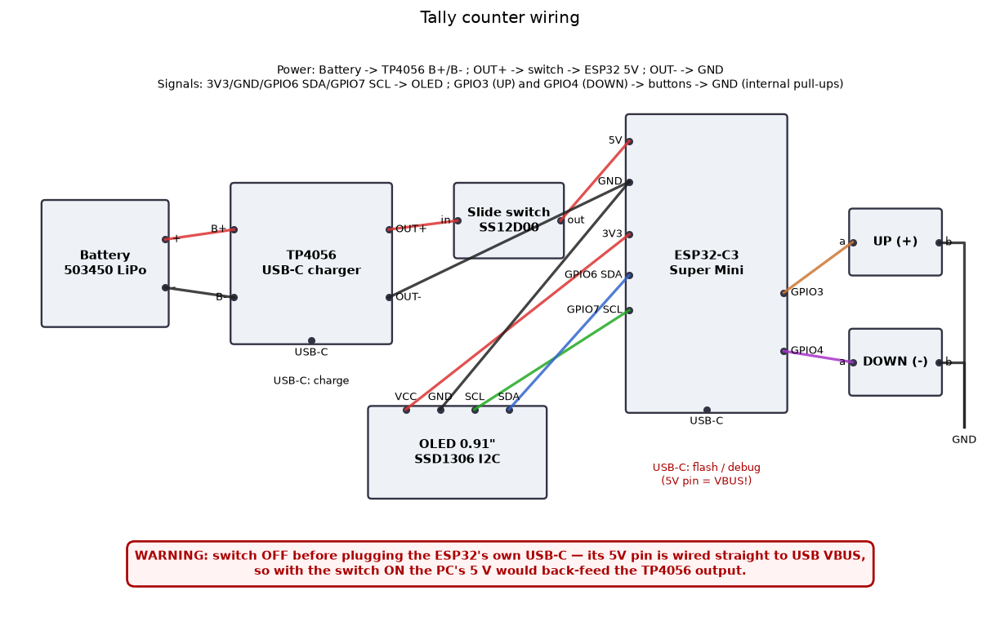
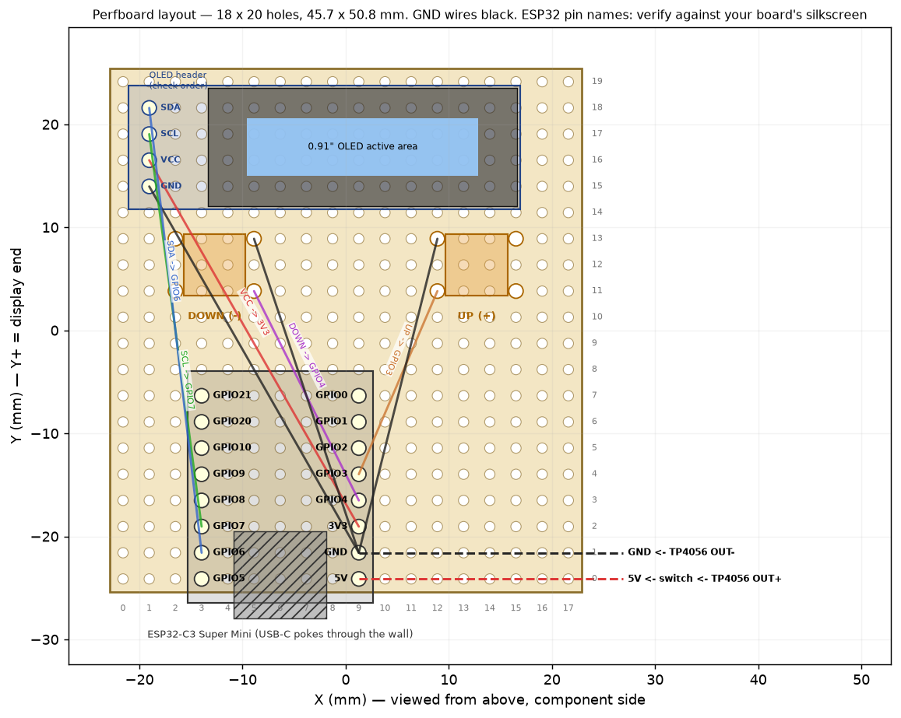

# ESP32 Tally Counter

A pocket tally counter: two buttons, a 0.91" OLED, an ESP32-C3 Super Mini and a
1000 mAh LiPo in a 58 × 58 × 22 mm 3D-printed case. Right button counts up, left
counts down, hold both for a second to reset. The count survives power-off, the
device deep-sleeps after 60 s and wakes on any button, and a slide switch cuts
power completely. Two firmwares share the same hardware: a **plain** one with no
radio, and an **ESPHome** one that exposes the count to Home Assistant. Everything
— the case STLs, the README images, both firmware binaries — is generated from
source through Docker + `make`; nothing is installed on the host.


*Closed (58.0 × 58.4 × 22.1 mm, both USB-C ports at the near end) and exploded,
with perfboard, battery, TP4056, ESP32 and OLED as ghosts.*

**Interactive preview:** [ardakilic.github.io/esp32-tally](https://ardakilic.github.io/esp32-tally/)
— or open [`case/preview.html`](case/preview.html) locally (self-contained, works offline).

## Features

- **UP** (right, "+") and **DOWN** (left, "−") buttons, range 0…99999, DOWN stops
  at 0; a click counts on **release**, debounced 20 ms.
- Hold **both ≥ 1 s → reset to 0**; the two releases that follow do not count.
- Count **persisted in flash** (NVS on the plain build, ESPHome `globals` with
  `restore_value` on the other); survives power-off and battery swaps.
- **60 s idle → OLED off + deep sleep**; either button wakes it (that press is not
  counted). Slide switch = hard power off.
- **Charging over USB-C** through a TP4056 module with cell protection; the ESP32's
  own USB-C is for flashing only and sits behind the lid (see [Power notes](#power-notes)).
- ESPHome variant adds Home Assistant entities: number **Tally Count** (settable),
  button **Reset Tally**, switch **Keep Awake** (blocks the idle sleep so OTA can run).
- Case: friction-fit lid, no screws, no supports, 4 parts, 28 cm³ of plastic.

## Bill of materials

| Part | Notes |
|---|---|
| ESP32-C3 Super Mini | the 18 × 22.5 mm board with two 8-pin rows; on male pin headers |
| 0.91" SSD1306 OLED, 128 × 32, I2C | 4-pin header (GND VCC SCL SDA on most — verify yours), address 0x3C |
| 2 × 6 × 6 mm tact switches | any height 4.3–6 mm; default 5.0, see [`--tact-height`](#fit-tuning) |
| TP4056 USB-C charger module | the common 17 × 28 mm board **with** DW01 protection (the variant with OUT+/OUT− pads); 1 A default |
| SS12D00 slide switch | 3-pin, 1P2T, 8.8 × 3.9 × 3.5 mm body, 2 mm travel |
| 1S LiPo pouch, 503450 | 34 × 50 × 5 mm, 1000 mAh, with PCM and JST-PH lead; other sizes via [`--battery`](#fit-tuning) (T ≤ 7 mm) |
| Perfboard, 2.54 mm pitch | cut to **18 × 20 holes** (45.7 × 50.8 mm) from a 5 × 7 cm board |
| Male pin headers | 2 × 8 for the Super Mini |
| Hook-up wire | thin silicone wire for the dozen connections below |
| 4 printed parts | base, lid, cap "+", cap "−" ([Case](#case)) |
| Hot glue | one dab to hold the slide switch |
| Optional: 3 mm foam pad | under the OLED's free end so it can't rock on its header |

## Wiring



| From | To | Notes |
|---|---|---|
| Battery + / − | TP4056 `B+` / `B−` | solder the JST-PH lead directly to the pads |
| TP4056 `OUT+` | slide switch common | the switched node is on the **high** side |
| slide switch throw (one of the two) | ESP32 `5V` | `5V` = USB VBUS net, see Power notes |
| TP4056 `OUT−` | ESP32 `GND` | OUT− is the protection-switched ground — star all grounds here |
| ESP32 `3V3` / `GND` | OLED `VCC` / `GND` | |
| ESP32 `GPIO6` | OLED `SDA` | I2C 0x3C |
| ESP32 `GPIO7` | OLED `SCL` | |
| UP button, pin 1 / pin 2 | ESP32 `GPIO3` / `GND` | internal pull-up, active low |
| DOWN button, pin 1 / pin 2 | ESP32 `GPIO4` / `GND` | internal pull-up, active low |



The perfboard is cut **between** hole rows to 18 columns × 20 rows (45.7 × 50.8 mm,
so each edge is half a pitch past the last hole) and drops onto the ledge inside
the case. Column 0 / row 0 is the bottom-left corner when the display end is up.
The Super Mini's two pin rows go into **columns 3 and 9, rows 0…7**, USB-C at the
bottom edge (it pokes 1.5 mm past the board edge into a pocket in the case wall).
The two tact switches are centred at **X ±12.7 mm on row 12** — their four legs land
in columns 2 & 5 (DOWN) and 12 & 15 (UP), rows 11 & 13. The OLED's 4-pin header
goes into **column 1, rows 15…18**, with the module extending to the right across
the top of the board. Pin names in the drawing follow the common Super Mini
silkscreen — **verify against your board** before soldering; OLED header order
varies (GND VCC SCL SDA on most modules).

### Power notes

Verified from the Super Mini schematic (links in
[Verified part geometry](#verified-part-geometry)):

- **The `5V` header pin is the USB VBUS net** — it sits *before* the BAT60J Schottky
  diode and the ME6211 3.3 V LDO. **Flip the slide switch OFF (or unplug the
  battery) before plugging a cable into the ESP32's own USB-C**, otherwise the PC's
  5 V back-feeds the TP4056 output and the battery. This is why the case hides the
  ESP32 port: you open the lid to flash.
- Battery path: V<sub>bat</sub> → BAT60J (≈0.2–0.3 V drop) → ME6211 → 3V3. Regulation
  holds down to ≈3.6–3.7 V; below ≈3.4 V the 3V3 rail sags — the plain build keeps
  running, the Wi-Fi build may brown out. The TP4056's DW01 cuts the cell at 2.4 V
  regardless, so nothing is damaged, the display just gets flaky near empty.
- The Super Mini's **red power LED** draws ≈1–3 mA even in deep sleep when fed
  through `5V`. Flip the switch when storing the counter, or desolder that LED
  for µA-level sleep.
- **Charge current** is the TP4056 default **1 A** (R<sub>PROG</sub> 1.2 kΩ): fine
  for cells ≥ 1000 mAh. For smaller cells swap R<sub>PROG</sub> (2 kΩ ≈ 580 mA).
- **Charge with the switch OFF** so the TP4056's full-charge indication isn't
  confused by the load.
- `OUT−` is the protection-switched node (DW01 switches the low side): star the
  grounds at `OUT−`, never at `B−`.

## Firmware

Both firmwares implement the same behaviour and pinout; pick one. Build outputs
are gitignored — `make` regenerates them from pinned Docker images.

### Plain (no network)

[`firmware/plain/`](firmware/plain/) — PlatformIO + Arduino core 3.3.12
(pioarduino platform 55.03.312-1), board `nologo_esp32c3_super_mini`,
`flash_mode = dio`, one library: U8g2 2.36.18.

| File | Role |
|---|---|
| [`platformio.ini`](firmware/plain/platformio.ini) | platform / board / U8g2 pins |
| [`src/tally_logic.h`](firmware/plain/src/tally_logic.h) | the button/count state machine — pure C++, no Arduino |
| [`src/main.cpp`](firmware/plain/src/main.cpp) | pins, OLED, NVS (`Preferences`, flushed 2 s after the last change), deep sleep |
| [`test/tally_logic_test.cpp`](firmware/plain/test/tally_logic_test.cpp) | assert-based self-test of the state machine, runs on the host in `gcc:14` |
| [`Dockerfile`](firmware/plain/Dockerfile) | `python:3.12-slim` + platformio 6.2.0 + git, `PLATFORMIO_CORE_DIR=/pio` |

```bash
make plain-test   # host self-test: prints OK
make plain        # -> firmware/plain/build/tally-plain.factory.bin
```

Result: RAM 4.6 % (15.2 KB), Flash 25.2 % (330 KB), merged image 403 KiB. The
`.factory.bin` is the complete flash image (bootloader @0x0, partitions @0x8000,
boot_app0 @0xe000, app @0x10000) — flash it at offset 0. No OTA: reflashing means
opening the lid.

### ESPHome (Home Assistant)

[`firmware/esphome/tally.yaml`](firmware/esphome/tally.yaml) — ESPHome 2026.9.1,
`esp-idf` framework, board `nologo_esp32c3_super_mini`. Substitution
`idle_sleep: 60s`. Entities in HA: number **Tally Count** (0…99999, box mode,
settable), button **Reset Tally**, switch **Keep Awake**.

1. Secrets: `cp firmware/esphome/secrets.yaml.example firmware/esphome/secrets.yaml`
   and fill in `wifi_ssid`, `wifi_password`, `api_key` (`openssl rand -base64 32`;
   used for both the HA API and OTA) and `ap_password` (fallback hotspot, ≥ 8 chars).
   `secrets.yaml` is gitignored; `make esphome` refuses to run without it.
2. Build (the container needs internet the first time: the Roboto font comes from
   Google Fonts at compile time, the IDF toolchain lands in the cache volume):

```bash
make esphome-config   # validate tally.yaml
make esphome          # -> firmware/esphome/.esphome/build/tally/build/firmware.factory.bin (983 KB)
                      #    and firmware.ota.bin next to it
make esphome-ota      # compile + OTA to DEVICE (default tally.local) after the first USB flash
```

Result: Flash 51 %, RAM 33 %. The device **still sleeps after 60 s** with Wi-Fi: HA
shows it unavailable in between, it reconnects on every wake and pushes the count.
Before an OTA, press a button to wake it and turn on **Keep Awake** within 60 s;
turning it off re-arms the idle timer.

### Flashing

Docker Desktop on macOS cannot pass USB through, so flash from the browser:

1. **Slide switch OFF** (or battery disconnected) — see [Power notes](#power-notes).
2. Open <https://web.esphome.io> in Chrome or Edge → **Connect** → pick the Super
   Mini's serial port → **Install** → choose the `.factory.bin`
   (`firmware/plain/build/tally-plain.factory.bin` or
   `firmware/esphome/.esphome/build/tally/build/firmware.factory.bin`).
3. If no port shows up, hold **BOOT** (GPIO9) while plugging the cable in, then retry.

Both images are full factory images, so switching between the two firmwares is just
another flash. After the first ESPHome flash, later updates go over the air
(`make esphome-ota`).

## Case

[`case/`](case/) — one Python script ([`generate.py`](case/generate.py), shapely +
trimesh + manifold3d, pinned, `python:3.14-slim`) builds four watertight STLs; the
same constants drive the README images and the geometry self-test.

### Parts

| STL | Size (mm) | Volume | Print orientation |
|---|---|---|---|
| [`case/stl/tally-base.stl`](case/stl/tally-base.stl) | 58.0 × 58.4 × 20.1 | 19.5 cm³ | upright, as exported |
| [`case/stl/tally-lid.stl`](case/stl/tally-lid.stl) | 58.0 × 58.4 × 9.5 | 7.6 cm³ | as exported (top face down) |
| [`case/stl/tally-cap-plus.stl`](case/stl/tally-cap-plus.stl) | 11 × 11 × 6 | 0.4 cm³ | on its flange, as exported |
| [`case/stl/tally-cap-minus.stl`](case/stl/tally-cap-minus.stl) | 11 × 11 × 6 | 0.4 cm³ | on its flange, as exported |

Closed: **58.0 × 58.4 × 22.1 mm**. Shell 2.0 mm walls / floor / lid plate, 1.2 mm lid
skirt, 4 mm outer corner radius. Features: friction-fit lid whose skirt slides
*inside* the frame and clamps the perfboard onto an internal ledge (0.28 mm
clearance per side); 27 × 9 mm OLED window; two Ø8.4 mm cap holes; an open-top slot
in the bottom wall for the ESP32's USB-C, closed by a notch in the lid skirt
(left, flash/debug); a USB-C window at floor level for the TP4056 (right, charge);
slide-switch slot on the right wall; 10 × 1.5 mm pry notch at the display end.

### Printing

- 0.2 mm layers, PLA or PETG, 0.4 mm nozzle.
- **No supports** in the exported orientations — the only overhang is the ledge's
  underside inside the base, 1.5 mm (ends) to 3.8 mm (sides) wide, which prints
  fine at 0.2 mm layers.
- Base upright; lid as exported (top face on the bed, so the window edge and the
  outer face are clean); caps on their flanges.

### Assembly

1. **TP4056**: USB-C first into the lower opening at the bottom end, the PCB end
   sinks 1 mm into its wall pocket; it lies against the right wall, the stop block
   sits behind it.
2. **Battery** into the left bay (lead towards the TP4056; the rib between them
   keeps the pouch off the charger).
3. **Slide switch**: drop it between its two ribs from the inside, handle through
   the slot in the right wall; a dab of hot glue holds it.
4. Solder and route the wires (table above); keep them below the ledge.
5. **Perfboard** onto the ledge, ESP32 USB-C end towards the bottom edge, so the
   receptacle sits in its wall slot.
6. **Caps** into the lid from below — "+" on the right, "−" on the left (as held,
   display up).
7. **Lid** on: the skirt notch goes over the ESP32 end; press down until the skirt
   is fully home.

Open it with a coin in the pry notch at the display end. Optionally stick a 3 mm
foam pad under the OLED's free end before closing.

### Fit tuning

Printers and kits vary; the three fit parameters are command-line flags shared by
the generator, the image renderer and the verifier:

| Flag | Default | Controls |
|---|---|---|
| `--clear-friction` | 0.28 mm | lid skirt clearance to the frame per side (filtarr's calibrated value); tune in ±0.04 steps |
| `--tact-height` | 5.0 mm | tact switch height, PCB top to plunger top — 4.3 / 5 / 6 are fine, ≤ 6.0 with the default 7.5 mm lid clearance |
| `--battery` | 34x52x6 | battery pouch envelope W×L×T incl. tabs and swelling; T ≤ 7 |

```bash
make case GEN_ARGS="--clear-friction 0.32"                  # lid too tight
make case GEN_ARGS="--tact-height 4.3"                      # shorter switches
make case GEN_ARGS="--battery 30x40x5"                      # smaller cell
make case-verify GEN_ARGS="--clear-friction 0.32 --tact-height 4.3"   # check before printing
```

Every other dimension (walls, PCB_Z 9, LID_CLEAR 7.5, window 27 × 9, switch
position SW_Y 14, …) is a named constant with a why-comment at the top of
[`case/generate.py`](case/generate.py).

## Interactive preview

Online at **[ardakilic.github.io/esp32-tally](https://ardakilic.github.io/esp32-tally/)**
(the [Pages workflow](.github/workflows/pages.yml) republishes the whole checkout on
every push to `main`; enable Pages once with Source = GitHub Actions), or locally —
[`case/preview.html`](case/preview.html) is one self-contained file (three.js and the
four STLs embedded, no internet needed), open it in any browser. Lift the lid and caps
with the **Explode** slider, toggle each part, switch on **X-ray lid** or the ghost
electronics (perfboard, battery, TP4056, ESP32, OLED, slide switch), and download
the exact STLs from the **Print these four** list; the Dimensions panel repeats the
tolerance and shell summary `generate.py` prints, so a tuned build shows its
`GEN_ARGS`. The landing page ([`index.html`](index.html)) links the preview, the
STLs, the README images and both firmware folders.

## Regenerating everything

```bash
make                  # case + plain + esphome
```

| Target | Does | Output |
|---|---|---|
| `make case` | build image, `generate.py`, `tools/render_docs.py` | `case/stl/*.stl`, `case/preview.html`, `index.html`, `case/docs/*.png` |
| `make case-verify` | 59 geometry checks on in-memory builds, exit 1 on failure | PASS/FAIL table |
| `make vendor` | fetch the latest three.js module build (stdlib-only, bare `python:3.14-slim`) | `case/vendor/three.{module,core}.min.js`, `THREE_VERSION` |
| `make plain` | build image, `pio run`, copy the factory image | `firmware/plain/build/tally-plain.factory.bin` |
| `make plain-test` | state-machine self-test in `gcc:14` | `OK` |
| `make esphome` | `esphome compile` (needs `secrets.yaml`) | `firmware/esphome/.esphome/build/tally/build/firmware.{factory,ota}.bin` |
| `make esphome-config` | `esphome config` | validated YAML |
| `make esphome-ota` | `esphome run --device $(DEVICE)` | flashed device |
| `make image-case` / `make image-plain` | (re)build the two Docker images | — |
| `make clean` | removes `case/stl case/docs case/preview.html index.html firmware/plain/.pio firmware/plain/build firmware/esphome/.esphome` | — |

Pinned images: `python:3.14-slim` + [`case/requirements.txt`](case/requirements.txt)
(the exact wheels the committed STLs were triangulated with), `python:3.12-slim` +
platformio 6.2.0, `ghcr.io/esphome/esphome:2026.9.1`, `gcc:14`. Caches live in two
named Docker volumes, never on the host: **`esp32-tally-pio`** (PlatformIO core —
pioarduino platform, Xtensa/RISC-V toolchain, Arduino framework, U8g2) and
**`esp32-tally-esphome-cache`** (ESPHome's PlatformIO/IDF cache). First builds
download a few hundred MB into them; rebuilds take seconds. `make clean` leaves
the volumes alone (`docker volume rm esp32-tally-pio esp32-tally-esphome-cache`
if you want them gone).

`case/stl/`, `case/docs/`, `case/preview.html`, `index.html` and `case/vendor/` are
**committed and never hand-edited**: change `generate.py` (or
`case/preview_template.html`), run `make case` + `make case-verify`, commit the
regenerated files together with the change; `make vendor` only when you want a newer
three.js. `make case-verify` ([`case/tools/verify.py`](case/tools/verify.py))
rebuilds every part in memory and checks: watertightness; bounding boxes; skirt =
opening − 2 × clearance; rays through the OLED window, both cap holes, both USB-C
openings and the switch slot; that the battery, TP4056, ESP32, OLED and switch
ghosts do not intersect the shell; and the cap-to-hole play. Pass it the same
`GEN_ARGS` as `make case`.

## Verified part geometry

Dimensions the case is built around (all in `generate.py` with their sources):

- **ESP32-C3 Super Mini** — PCB 18 × 22.5 mm, two 8-pin rows 15.24 mm apart
  (6 pitches), first pin centre 2.36 mm from the USB edge, USB-C shell 9 × 3.2 mm
  overhanging the PCB by 1.5 mm, module on 2.54 mm header spacers + 1.0 mm PCB;
  `5V` pin = VBUS before the BAT60J diode and ME6211 LDO —
  [schematic (mischianti.org)](https://mischianti.org/wp-content/uploads/2025/07/esp32-c3-supermini-schematics.pdf).
- **ME6211** LDO (3.3 V variant on the board) — low dropout, hence the ≈3.6–3.7 V
  regulation floor quoted above —
  [family datasheet (LCSC)](https://wmsc.lcsc.com/wmsc/upload/file/pdf/v2/lcsc/2201121200_MICRONE-Nanjing-Micro-One-Elec-ME6211C25M5G_C2835813.pdf).
- **6 × 6 mm tact switch** — Omron B3F family: body 6 × 6, plunger Ø3.5, heights
  4.3 / 5.0 / 6.0 / 7.0 mm, legs 6.5 × 4.5 mm apart → 3 × 2 perfboard pitches
  (columns 2 & 5 / 12 & 15, rows 11 & 13) —
  [B3F datasheet](https://omronfs.omron.com/en_US/ecb/products/pdf/en-b3f.pdf).
- **SS12D00 slide switch** — body 8.8 × 3.9 × 3.5 mm, handle 1.5 mm, travel 2.0 mm
  (slot 4.0 × 2.0 mm incl. 0.5 mm play) —
  [datasheet](https://www.vimex.com/switches/techdocs/SS12D00-tech.pdf).
- **0.91" 128 × 32 OLED** — module PCB 38 × 12 mm, glass 30 × 11.5 mm, active area
  22.4 × 5.6 mm, header pin centres 2.0 mm from the short edge, 6.9 mm tall at the
  IC seal cover — [panel datasheet](https://www.icbanq.com/icdownload/V2_DATA/ICBShop/Board/HP12832-01-TSWG14P091-A-VER1.0.pdf).
- **TP4056 USB-C module** — PCB 17 × 28 × 1.0 mm, USB-C shell 9 × 3.2 mm overhanging
  1.0 mm, R<sub>PROG</sub> 1.2 kΩ → 1 A, DW01 protection switching the low side —
  [module manual](https://shillehtek.com/blogs/shillehtek-product-manuals/tp4056-1a-lipo-battery-charging-board-type-c-with-current-protection-manual).
- **503450 LiPo** — 34 × 50 × 5 mm nominal, modelled as 34 × 52 × 6 (PCM tab +
  1 mm swelling) with 0.5 mm air to every wall.
- **Perfboard** — 2.54 mm pitch, 1.6 mm FR4, 18 × 20 holes → 45.72 × 50.8 mm.

## Not yet verified on hardware

Nothing in this repo has been flashed or printed yet. Everything above is from
datasheets, the schematic, the geometry self-test and a host-side test of the
state machine. Open points, in the order they'd bite:

- **Deep-sleep wake on both buttons** (GPIO3 | GPIO4 mask via
  `esp_deep_sleep_enable_gpio_wakeup`) — compiles on both builds, untested on
  silicon.
- The ESPHome **`millis() > 1500` wake-press guard** (the press that woke the chip
  is already ON at boot; its release must not count) — margin chosen by reasoning,
  not measured boot time.
- **Friction fit 0.28 mm** is filtarr's calibrated value on a different, larger
  part; expect to tune `--clear-friction`.
- **OLED window offset** `OLED_AA_DX` 3.7 mm (active area vs PCB centre) — measure
  your module; it differs between 0.91" boards.
- **OLED header order** — GND VCC SCL SDA assumed in the drawings.
- **TP4056 variant size** — 17 × 28 mm boards are the norm, some USB-C variants
  are 17 × 26 or have the receptacle further in; the wall pocket is 1 mm deep.

Found something? Open an issue with the measurement.

## License

Dual-licensed:

- **Code** (firmware, generator, tooling): [MIT](LICENSE)
- **Models & images** (STLs, renders): [CC BY 4.0](LICENSE-MODELS) — use, share,
  sell and remix freely, but credit this project with a link back when you
  redistribute the models.
